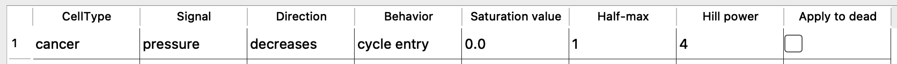
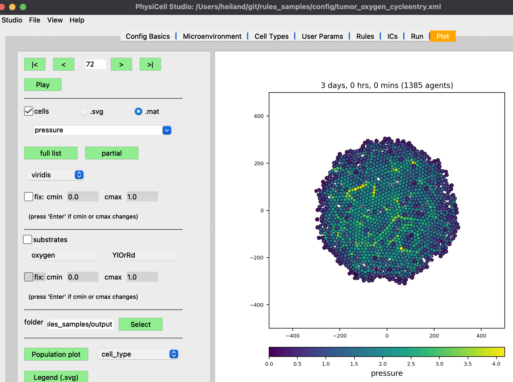
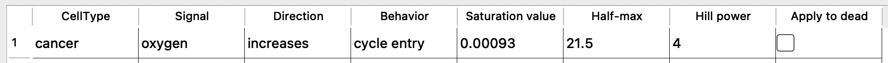
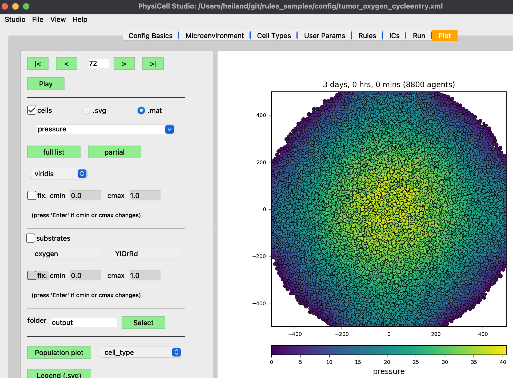

# rules_samples

Provide sample PhysiCell models (user_projects) that use simple rules.

| Description             |  Rule, final plot          |  user_proj (.zip)
:-------------------------:|:-------------------------:|:-------------------|
pressure decreases cycle entry |  | foo1.zip
. |  | .
oxygen increases cycle entry |  | foo2.zip
. |  | .
